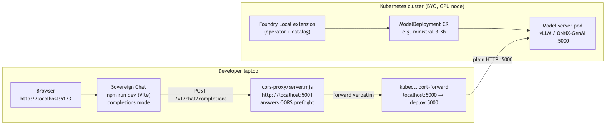
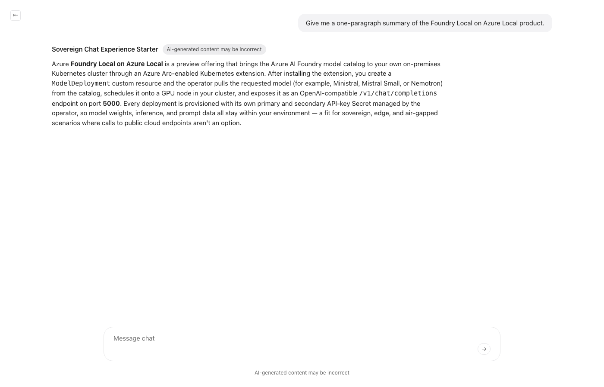

# Foundry Local on Azure Local — Chat Quickstart

> _A zero-to-running quickstart that wires a model from the Foundry Local catalog to the Sovereign Chat Experience starter. Bring your own GPU-equipped Kubernetes cluster; you'll be chatting with a locally-served model in about 15 minutes._

## Overview

This sample is the fastest path from "I just installed the Foundry Local extension on my Kubernetes cluster" to "I'm chatting with a locally-served model in a Copilot-style chat app on my laptop." It glues together two existing Azure-Samples projects without writing new application code.

This is **not a production deployment** — treat it as a guided tour you can finish in 15 minutes. For deeper coverage of the model catalog lifecycle see [`Azure-Samples/foundry-local-model-catalog`](https://github.com/Azure-Samples/foundry-local-model-catalog); for a production-shaped deployment of the chat UI see [`Azure-Samples/sovereign-chat-experience-starter`](https://github.com/Azure-Samples/sovereign-chat-experience-starter).

## Architecture



- **In your Kubernetes cluster** — the Foundry Local extension installs an operator and a model catalog. You create a `ModelDeployment` custom resource; the operator pulls the model from the catalog and runs it behind a `Service` on port `5000`, exposing an OpenAI-compatible `/v1/chat/completions` endpoint.
- **On your laptop** — you clone the [Sovereign Chat Experience starter](https://github.com/Azure-Samples/sovereign-chat-experience-starter) and run it in dev mode (`npm run dev`). You configure it in `completions` mode so the browser calls `/v1/chat/completions` directly.
- **The bridge** — a `kubectl port-forward` exposes the in-cluster model on your laptop, and a small Node script (`chat-ui/cors-proxy/server.mjs`) sits in front of it to satisfy the browser's CORS preflight. **This bridge is a quickstart accommodation — not a production architecture.** See [From quickstart to production](#from-quickstart-to-production) for what to replace it with.

## Prerequisites

You'll need:

| Requirement | Minimum | How to check |
|---|---|---|
| Kubernetes cluster (BYO) | Any conformant cluster (Azure Local with AKS, AKS, kind/k3d with GPU, etc.), version **1.29+** (required by the Foundry Local install guide linked in [Step 2](#2-install-the-foundry-local-extension-on-your-cluster)) | `kubectl get nodes` shows server `VERSION` ≥ 1.29 |
| GPU on at least one node | 1× GPU with ≥8 GB VRAM for the default model | `kubectl get nodes -o json \| jq '.items[].status.allocatable["nvidia.com/gpu"]'` |
| Foundry Local on Azure Local access | Preview access granted + the Arc extension installed on your cluster per [Step 2](#2-install-the-foundry-local-extension-on-your-cluster) | `kubectl get pods -n foundry-local-operator` shows an `inference-operator-*` pod `Running` |
| `kubectl` | 1.27+ | `kubectl version --client` |
| `git` | 2.30+ | `git --version` |
| Node.js | 18 LTS or 20 LTS (for the chat UI dev server) | `node --version` |
| `npm` | 9+ | `npm --version` |
| `jq` | 1.6+ (used by the GPU check above and the model-id check in Step 7) | `jq --version` |

This sample assumes you have a GPU. The chat UI works without one, but no model in the alternates set is configured to run on CPU. If your cluster has only CPU nodes, see [`Azure-Samples/foundry-local-model-catalog`](https://github.com/Azure-Samples/foundry-local-model-catalog) for a CPU-only path.

## GPU sizing & choosing a model

Pick the manifest in `manifests/` that fits the largest GPU you can spare on a single node. The default is **Ministral 3 3B** so the quickstart works on the widest range of hardware.

| Tier | Manifest | VRAM needed | When to pick it |
|---|---|---|---|
| **Default** | `manifests/ministral-3-3b.yaml` | ~8 GB | Any modern GPU. Fastest path to "it works." |
| Mid-size | `manifests/ministral-large.yaml` | ~16 GB | Mid-range GPU; better chat quality than the default. |
| Large | `manifests/mistral-small.yaml` | 24–48 GB | A single large GPU; solid chat quality. |
| A100 80 GB | `manifests/nemotron-80gb.yaml` | 80 GB | A100 80 GB or equivalent; highest-quality demo in this set. |

You can check the GPU memory available on each node with:

```bash
kubectl get nodes -o custom-columns=NAME:.metadata.name,GPU:.status.allocatable."nvidia\.com/gpu"
```

## Quickstart

### 1. Clone this repo

```bash
git clone https://github.com/Azure-Samples/local-chat-with-foundry-local.git
cd local-chat-with-foundry-local
```

### 2. Install the Foundry Local extension on your cluster

Foundry Local on Azure Local is currently in preview and access is granted by request. The installation steps — prerequisites, preview access request, and the exact `az k8s-extension create` invocation — are documented in the official install guide:

**[Deploy Foundry Local as an Azure Arc extension](https://learn.microsoft.com/en-us/azure/azure-sovereign-clouds/private/foundry-local/deploy-foundry-local-arc-extension)**

Once installation completes, verify the operator pods are running:

```bash
kubectl get pods -n foundry-local-operator
```

Expected output — at minimum an `inference-operator-*` pod must be `Running`. The install typically also brings up several supporting pods (`inference-operator-api-*`, `inference-operator-model-store-*`, `telemetry-collector-*`, and friends); the exact set depends on the install profile and chart version. Check the install guide above for the authoritative list. A healthy install looks like:

```text
NAME                                              READY   STATUS    RESTARTS   AGE
inference-operator-xxxxxxxxx-yyyyy                3/3     Running   0          30s
inference-operator-api-xxxxxxxxx-yyyyy            5/5     Running   0          30s
inference-operator-model-store-xxxxxxxxx-yyyyy    2/2     Running   0          30s
...
```

### 3. Deploy a model

You'll deploy the default model, **Ministral 3 3B**, by applying a `ModelDeployment` custom resource. Open `manifests/ministral-3-3b.yaml` and read it — it's short, and you'll see exactly what you're creating (model name, version, GPU, memory).

```bash
# From the root of this repo
cat manifests/ministral-3-3b.yaml

# Apply it
kubectl apply -f manifests/ministral-3-3b.yaml
```

Expected:

```text
modeldeployment.foundrylocal.azure.com/ministral-3-3b created
```

For the full `ModelDeployment` schema reference, see [Quickstart: Deploy your first model and run inference on Foundry Local on Azure Local](https://learn.microsoft.com/en-us/azure/azure-sovereign-clouds/private/foundry-local/deploy-run-first-model?tabs=kubectl).

> Want a different model? Skip ahead to [Swap to a different model](#swap-to-a-different-model) before continuing — the rest of the quickstart works the same.

### 4. Wait for the model to be ready

The operator pulls the model from the catalog (this can take a few minutes for a first pull) and brings up the inference pod. Wait for it to report `Running`.

```bash
# Block until the deployment reports state=Running (typical: 1–5 minutes for a first pull)
kubectl wait \
  --for=jsonpath='{.status.state}'=Running \
  --timeout=15m \
  -n foundry-local-operator \
  modeldeployment/ministral-3-3b

# Find the Service the operator created for the model
kubectl get svc -n foundry-local-operator
```

Expected output (your `Service` name will be derived from the deployment name):

```text
NAME             TYPE        CLUSTER-IP      EXTERNAL-IP   PORT(S)    AGE
ministral-3-3b   ClusterIP   10.0.x.x        <none>        5000/TCP   2m
```

Step 7 port-forwards to the **Deployment** directly (not the Service) so traffic stays plain HTTP. The `kubectl port-forward` tunnel itself is still TLS-encrypted by Kubernetes.

### 5. Clone the chat UI

On your laptop, clone the [Sovereign Chat Experience starter](https://github.com/Azure-Samples/sovereign-chat-experience-starter) **next to** this repo (so the path `../local-chat-with-foundry-local/chat-ui/.env.example` resolves):

```bash
# From the parent directory that contains this repo
cd ..
git clone https://github.com/Azure-Samples/sovereign-chat-experience-starter.git
cd sovereign-chat-experience-starter
```

You should now have two sibling directories: `local-chat-with-foundry-local/` and `sovereign-chat-experience-starter/`.

### 6. Configure the chat UI `.env`

Copy the pre-filled `.env` from this repo into the chat UI repo:

```bash
# From the sovereign-chat-experience-starter directory
cp ../local-chat-with-foundry-local/chat-ui/.env.example .env
```

The Foundry Local operator enables per-deployment API-key authentication by default — every `ModelDeployment` gets a `<deployment-name>-api-keys` Secret with a primary/secondary key pair. Fetch the primary key and paste it onto the `VITE_COMPLETIONS_API_KEY=` line of your `.env`:

```bash
# Print the primary key for ministral-3-3b
kubectl get secret ministral-3-3b-api-keys \
  -n foundry-local-operator \
  -o jsonpath='{.data.primary-key}' | base64 -d; echo

# Open .env, paste the value after VITE_COMPLETIONS_API_KEY=, save, then:
cat .env
```

The defaults select **completions mode** and point at `http://localhost:5001/v1` — the local CORS proxy backend you'll start in step 7a. That proxy in turn forwards to the model `Deployment` exposed by step 7's `kubectl port-forward` on `localhost:5000`. When you swap to a different model later you'll need to update **two** values:

- `VITE_COMPLETIONS_MODEL` — the model identifier the new model server reports (see the [Swap section](#swap-to-a-different-model) for how to find it)
- `VITE_COMPLETIONS_API_KEY` — the new deployment has its own per-deployment key pair under `<new-deployment-name>-api-keys`

### 7. Port-forward the model deployment

Open a **new terminal** and keep it running for the rest of the session. This forwards to the model `Deployment` directly (bypassing the operator's nginx TLS sidecar — see the note at the end of step 4):

```bash
kubectl port-forward \
  -n foundry-local-operator \
  deploy/ministral-3-3b \
  5000:5000
```

Expected output (leave it running — don't close this terminal):

```text
Forwarding from 127.0.0.1:5000 -> 5000
Forwarding from [::1]:5000 -> 5000
```

Quick sanity check from a third terminal:

```bash
curl -s http://localhost:5000/v1/models | jq
```

Expected: a JSON payload listing one model. Confirm that `data[0].id` matches the value you put on the `VITE_COMPLETIONS_MODEL=` line of your `.env` in step 6 — for the default `ministral-3-3b.yaml` manifest this is `ministral-3-3b-instruct-2512`. If the id doesn't match, the chat UI will return `model not found` in step 9 — fix it in `.env` and restart `npm run dev`.

> **macOS note.** macOS Control Center / AirPlay listens on port `5000` by default. If your port-forward output reads `Handling connection for 5000` once and then sits silent, or `curl` returns a 403 from `AirTunes`, disable AirPlay Receiver in **System Settings → General → AirDrop & Handoff** (or pick a different local port: `kubectl port-forward ... 5050:5000` and set `UPSTREAM=http://localhost:5050` when you start the proxy in the next step).

### 7a. Run the CORS proxy backend

The chat UI's browser POST to the model triggers a CORS preflight that Foundry Local's auth sidecar rejects. To unblock the quickstart we ship a tiny Node script (`chat-ui/cors-proxy/server.mjs`) that answers the preflight locally and forwards everything else to your port-forward. No dependencies — just Node 18+. See [`chat-ui/cors-proxy/README.md`](./chat-ui/cors-proxy/README.md) for the why and the config knobs.

Open a **fourth terminal** at the root of this repo and start it:

```bash
node chat-ui/cors-proxy/server.mjs
```

Expected output (leave it running):

```text
[cors-proxy] listening on http://localhost:5001 -> http://localhost:5000
[cors-proxy] set VITE_API_URL=http://localhost:5001/v1 in the chat UI's .env
[cors-proxy] press Ctrl+C to stop
```

Your chat UI `.env` already points at `http://localhost:5001/v1` (set in step 6 from this repo's `chat-ui/.env.example`), so there's nothing to change. See [`chat-ui/cors-proxy/README.md`](./chat-ui/cors-proxy/README.md) for the full configuration surface (`PORT`, `UPSTREAM`) and a deeper explanation of what the proxy does and why.

This proxy is a **quickstart accommodation, not a production architecture** — see [From quickstart to production](#from-quickstart-to-production) below.

### 8. Run the chat UI

Back in your **first** terminal — still inside `sovereign-chat-experience-starter/`:

```bash
npm install
npm run dev
```

Expected output (Vite dev server starting):

```text
  VITE v7.x.x  ready in <ms>

  ➜  Local:   http://localhost:5173/
  ➜  Network: use --host to expose
  ➜  press h + enter to show help
```

Open the URL shown next to `Local:` in your browser.

### 9. Chat with your model

You should see a Copilot-style chat interface. Send a prompt — for example: _"Give me a one-paragraph summary of the Foundry Local on Azure Local product."_



The response streams from the in-cluster model through your port-forward into the chat UI in your browser. You are now running an end-to-end on-prem chat app: model in the cluster, UI on your laptop, no cloud calls.

## Swap to a different model

To try a larger model, pick the manifest that fits your GPU from the [GPU sizing table](#gpu-sizing--choosing-a-model), then:

```bash
# Pick the manifest that fits your GPU
MANIFEST=manifests/ministral-large.yaml   # or mistral-small.yaml / nemotron-80gb.yaml

# Tear down the current model
kubectl delete -f manifests/ministral-3-3b.yaml

# Deploy the new one
kubectl apply -f $MANIFEST

# Capture the deployment name from the manifest itself
DEPLOYMENT=$(kubectl get -f $MANIFEST -o jsonpath='{.metadata.name}')

# Wait for it
kubectl wait \
  --for=jsonpath='{.status.state}'=Running \
  --timeout=20m \
  -n foundry-local-operator \
  modeldeployment/$DEPLOYMENT

# Restart the port-forward against the new Deployment
kubectl port-forward -n foundry-local-operator deploy/$DEPLOYMENT 5000:5000
```

In the chat UI repo, update **two** values in your `.env` before restarting `npm run dev`:

```bash
# 1. The model identifier (vLLM reports it; copy from data[0].id)
curl -s http://localhost:5000/v1/models | jq -r '.data[0].id'
# Paste the returned id onto the VITE_COMPLETIONS_MODEL= line.

# 2. The API key (each deployment has its own primary/secondary key pair)
kubectl get secret ${DEPLOYMENT}-api-keys \
  -n foundry-local-operator \
  -o jsonpath='{.data.primary-key}' | base64 -d; echo
# Paste the returned key onto the VITE_COMPLETIONS_API_KEY= line.

# Then restart the chat UI dev server
npm run dev
```

## From quickstart to production

This sample optimizes for time-to-first-token, not for production-readiness. The biggest shortcut it takes is that **the chat UI talks from the browser to the model endpoint**, with a single tiny script (`chat-ui/cors-proxy/server.mjs`, started in [Step 7a](#7a-run-the-cors-proxy-backend)) standing in for the backend any real-world deployment would have between the two. For a production-shaped deployment you would replace this proxy with your own server. That server is what would normally:

- Hold the per-deployment Foundry Local API key as a server-side secret (never shipped to the browser).
- Authenticate your end-users against your identity provider (e.g. Entra ID), then attach the Foundry Local key on the user's behalf when forwarding the request.
- Apply rate limiting, request/response logging, content filtering, audit, billing, and any other policy your deployment needs.
- Expose its own HTTP API to your chat UI (with whatever CORS, TLS, and routing make sense for your hosting model).

In that architecture the `chat-ui/cors-proxy/` script is unnecessary — your own backend is the thing answering the browser's preflight, and it talks to Foundry Local server-to-server (no preflight). The rest of the quickstart's cluster-side setup (the `ModelDeployment` CRD, the operator-templated `Service`, the per-deployment API key Secret) carries over to production unchanged; only the laptop-side shape between the browser and Foundry Local changes.

## Clean up

Stop the dev server (Ctrl-C in the terminal running `npm run dev`), the CORS proxy (Ctrl-C in the terminal running `node chat-ui/cors-proxy/server.mjs`), and the port-forward (Ctrl-C in its terminal), then tear down the cluster-side resources:

```bash
# Delete the model deployment(s) you applied
kubectl delete -f manifests/ministral-3-3b.yaml
```

To uninstall the Foundry Local extension itself, follow the **Uninstall** section of the same Arc-extension install guide referenced in [Step 2](#2-install-the-foundry-local-extension-on-your-cluster). Skip this if you are sharing the cluster with other users.

```bash
# (Optional) remove the namespace, only after the extension is uninstalled
kubectl delete namespace foundry-local-operator
```

The chat UI repo and this repo can be deleted from your laptop with `rm -rf`. No cloud resources are created by this sample, so there's nothing further to bill or clean up.

## Troubleshooting

<details>
<summary><strong>The model pod stays in <code>Pending</code> forever.</strong></summary>

Run `kubectl describe modeldeployment/<name> -n foundry-local-operator` and `kubectl describe pod -n foundry-local-operator -l app.kubernetes.io/name=<name>`. The most common cause is no GPU node matching the `foundry/workload: gpu` selector — confirm `kubectl get nodes -l foundry/workload=gpu` returns at least one node. The second most common cause is GPU exhaustion: the operator schedules one model per GPU, so a second `ModelDeployment` will sit `Pending` until you delete the first.

</details>

<details>
<summary><strong><code>nvidia.com/gpu</code> shows <code>0</code> on every node.</strong></summary>

The NVIDIA device plugin is not installed (or its pod is failing). This sample assumes the GPU plugin is already present on your cluster — see your distro's docs (AKS GPU node pool, NVIDIA GPU Operator for kind/k3d, etc.).

</details>

<details>
<summary><strong><code>kubectl port-forward</code> dropped.</strong></summary>

Port-forward sessions die on network blips. Just re-run the same `kubectl port-forward ...` command — no other state to restore.

</details>

<details>
<summary><strong><code>curl http://localhost:5000/v1/models</code> returns <code>400 The plain HTTP request was sent to HTTPS port</code>.</strong></summary>

You port-forwarded to the `Service` (`svc/<name>`) instead of the `Deployment` (`deploy/<name>`). The operator wraps every `Service` with an nginx TLS sidecar (port-name `https`, targetPort `8443`), so plain HTTP to `svc/...` fails by design. Re-run the step 7 port-forward against `deploy/<name>` to reach the inference container's plain-HTTP port directly.

</details>

<details>
<summary><strong>Chat UI returns <code>401</code>, <code>missing_credentials</code>, or <code>No Bearer token or API key provided</code>.</strong></summary>

`VITE_COMPLETIONS_API_KEY` is empty or wrong in your `.env`. Re-fetch it from the operator-managed Secret (`kubectl get secret <deployment-name>-api-keys -n foundry-local-operator -o jsonpath='{.data.primary-key}' | base64 -d`) and restart `npm run dev`.

</details>

<details>
<summary><strong>Chat UI returns "Failed to fetch" or shows a CORS error in DevTools.</strong></summary>

The CORS proxy from step 7a is not running, or it can't reach the port-forward from step 7. Check three things, in order:

1. **Proxy alive?** The fourth terminal should still be showing `[cors-proxy] listening on http://localhost:5001 -> http://localhost:5000`. If it exited, restart it with `node chat-ui/cors-proxy/server.mjs`.
2. **Port-forward alive?** From a fifth terminal, `curl -s http://localhost:5000/v1/models` should return JSON. If it fails, re-run the step 7 `kubectl port-forward` command.
3. **Proxy → port-forward path alive?** `curl -s http://localhost:5001/v1/models` should return the same JSON. If step 2 worked but this doesn't, the proxy is up but its `UPSTREAM` is pointing somewhere else — restart it with the right value (default is `http://localhost:5000`; see [`chat-ui/cors-proxy/README.md`](./chat-ui/cors-proxy/README.md)).

If all three pass but the chat UI still errors, hard-refresh the chat UI page so it picks up the current `.env`.

</details>

<details>
<summary><strong>Chat UI says "model not found" in the response.</strong></summary>

`VITE_COMPLETIONS_MODEL` in your `.env` doesn't match what the in-cluster model server reports. Common causes: (1) you swapped models without updating `.env` — every deployment exposes a different model id; (2) the operator templated a slightly different id than you expected. Run `curl -s http://localhost:5000/v1/models | jq -r '.data[0].id'`, copy the value onto the `VITE_COMPLETIONS_MODEL=` line of `.env`, then restart `npm run dev`.

</details>

## Related samples & further reading

This sample is one of three Azure-Samples repos that, together, cover the Foundry Local on Azure Local + chat surface:

- [`Azure-Samples/foundry-local-model-catalog`](https://github.com/Azure-Samples/foundry-local-model-catalog) — deep dive on the model catalog and deployment lifecycle (catalog query, deploy, inference, cleanup).
- [`Azure-Samples/sovereign-chat-experience-starter`](https://github.com/Azure-Samples/sovereign-chat-experience-starter) — the standalone chat UI used here. Also available as an AZD template for cloud-hosted scenarios.

Blog posts:

- [Tech Community — Foundry Local model catalog (Part 1)](https://aka.ms/foundry-local-model-catalog-blog)

## Contributing

See [`CONTRIBUTING.md`](./CONTRIBUTING.md).

## License

MIT — see [`LICENSE`](./LICENSE).
